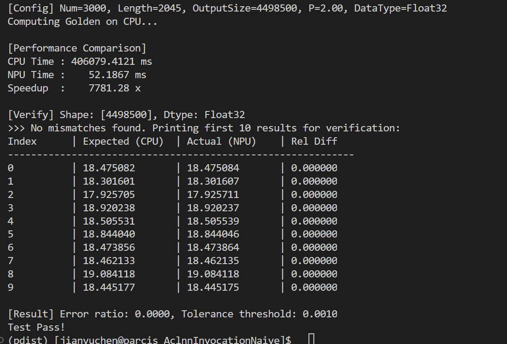
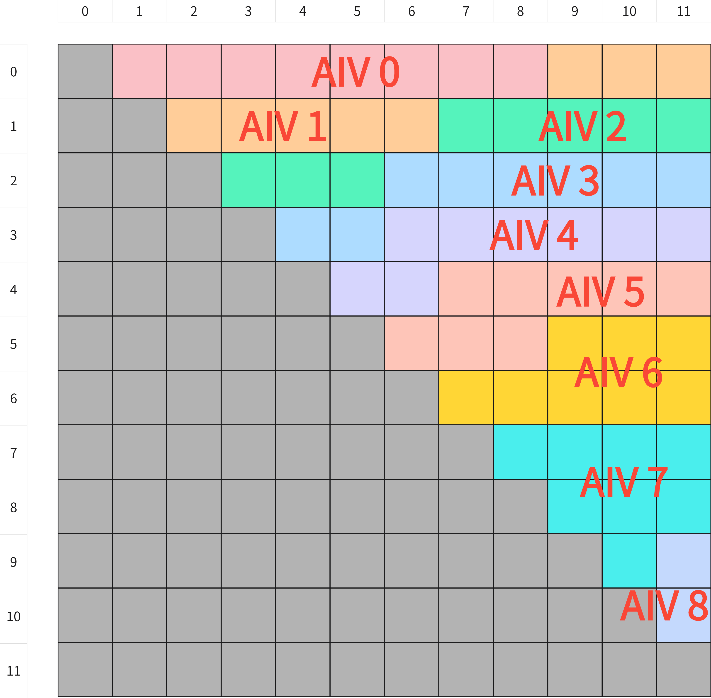
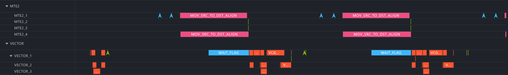
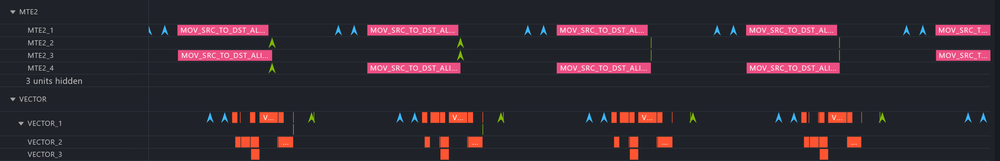
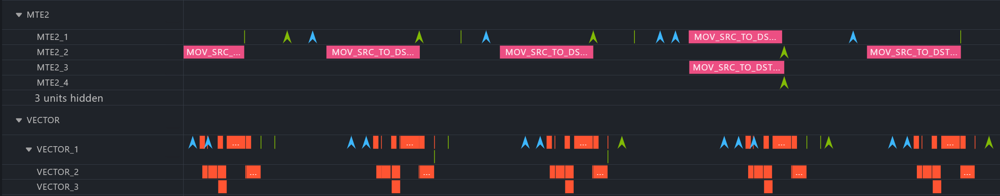

# Pdist - 华为昇腾NPU高性能Pairwise Distance算子


Pdist 是一个专为华为昇腾 NPU 硬件优化的自定义 Pairwise Distance（成对距离）算子实现。该算子基于 Ascend C 编程模型设计，提供高效的向量间距离计算功能，支持多种距离度量和数据类型，并通过智能策略选择实现最优性能。

---

## 目录

- [项目概述](#项目概述)
- [目录结构](#目录结构)
- [构建与运行](#构建与运行)
- [算子设计](#算子设计)
- [算子性能优化详解](#算子性能优化详解)
- [实验数据](#实验数据)
---

## 项目概述

### 支持的距离度量

| 距离类型 | 参数 p | 计算公式 | 应用场景 |
|---------|--------|----------|----------|
| **L1 距离** | `p=1` | $\|x-y\|_1 = \sum \|x_i - y_i\|$ | 曼哈顿距离、网格路径计算 |
| **L2 距离** | `p=2` | $\|x-y\|_2 = \sqrt{\sum (x_i - y_i)^2}$ | 欧几里得距离、最常用 |
| **L∞ 距离** | `p=inf` | $\|x-y\|_\infty = \max \|x_i - y_i\|$ | 切比雪夫距离、棋盘距离 |

### 数据类型支持

- **Float32 (FP32)** - 高精度计算，适用于对精度要求较高的场景
- **Float16 (FP16)** - 高性能计算，适用于大规模数据处理

---

## 目录结构

```
Pdist/
├── AclnnInvocationNaive/           # ACLNN API 原生调用示例
│   ├── main.cpp                    # 主程序：使用ACLNN接口调用Pdist算子
│   ├── CMakeLists.txt              # CMake构建配置
│   └── run.sh                      # 运行脚本
│
├── PdistFramework/                 # 算子框架与构建系统
│   ├── framework/                  # TensorFlow插件注册
│   ├── PdistCustom.json            # 算子定义文件（输入/输出/属性）
│   ├── build.sh                    # 构建脚本
│   ├── CMakeLists.txt              # 主CMake配置
│   ├── CMakePresets.json           # CMake预设配置
│   ├── cmake/                      # CMake模块和工具脚本
│   ├── op_kernel/                  # 算子内核Python接口
│   ├── op_host/                    # 算子Host侧代码
│   └── scripts/                    # 安装和升级脚本
│
├── PdistKernel/                    # PyTorch扩展实现（推荐）
│   ├── pdist_custom.cpp            # AscendC内核实现（Device侧）
│   ├── pdist_policies.h            # 距离计算策略模板定义
│   ├── pdist_custom_tiling.h       # Tiling数据结构和Pattern定义
│   ├── pdist_custom_tiling.cpp     # Tiling生成算法实现
│   ├── pybind11.cpp                # Python绑定（PyTorch接口）
│   ├── pdist_custom_test.py        # 单元测试脚本
│   ├── run.sh                      # 运行脚本
│   └── CMakeLists.txt              # CMake构建配置
│
├── PdistKernelInvocation/          # 算子独立调用程序
│   ├── pdist_custom.cpp            # 内核实现（与PdistKernel相同）
│   ├── pdist_policies.h            # 策略定义（需补充）
│   ├── pdist_custom_tiling.h       # Tiling定义
│   ├── data_utils.h                # 数据工具函数（文件读写/打印）
│   ├── scripts/                    # 辅助脚本
│   │   ├── gen_data.py             # 测试数据生成
│   │   └── verify_result.py        # 结果验证
│   ├── cmake/                      # CMake模块
│   ├── run.sh                      # 运行脚本
│   └── CMakeLists.txt              # CMake构建配置
│
├── .gitignore                      # Git忽略规则
└── README.md                       # 本文档
```

---

## 构建与运行

### 环境要求

| 组件 | 版本要求 |
|------|----------|
| 硬件 | 华为昇腾 NPU (Ascend910B4) |
| CANN | 8.1 或更高版本 |
| CMake | 3.16 或更高版本 |
| Python | 3.9+ |
| PyTorch | 需安装 torch_npu |

### 方法一：使用PdistKernel（PyTorch扩展，主要用于快速验证）
#### 1. 配置参数
进入pdist_custom_Test.py文件下的TestCustomPdist.test_pdist_custom_ops()函数下修改如下部分:
```python
def test_pdist_custom_ops(self):
  shape = [100, 400] # 支持任意形状
  p = 2.0  # 1.0, 2.0, float('inf')
  dtype = torch.float32  # torch.float32, torch.float16
```
#### 2. 运行
```bash
cd PdistKernel
bash run.sh -v Ascend910B4
```

### 方法二：使用PdistKernelInvocation（独立程序，主要用于性能分析）
#### 1. 配置参数
需要修改两个文件，首先进入main.cpp的main()函数修改以下部分：
```C++
int32_t main(int32_t argc, char *argv[])
{
  // ================= 1. 配置参数 =================
  // 这里的参数必须与 gen_data.py 中的配置一致
  uint32_t num = 100;         // 样本数量 N 
  uint32_t length = 400;      // 样本长度 D
  float p = 1.0f;          // 1.0f, 2.0f, INFINITY
  uint32_t isHalf = 0;        // 1 代表 float16, 0 代表float32
  uint32_t blockDim = 40;      // 核数(1 ~ 40)
  ...
}
```
然后进入scripts/gen_data.py下的gen_golden_data_pdist()函数修改以下部分：
```python
def gen_golden_data_pdist():
  # ================= 配置参数 =================
  # 可以在此处修改测试规模和数据类型
  num = 100            # 样本数量 (N)
  length = 400         # 样本长度 (D)
  p_val = 1.0        # 1.0, 2.0 float('inf')
  dtype = torch.float32  # torch.float32, torch.float16
  # ===========================================
```
#### 2. 运行
```bash
cd PdistKernelInvocation
bash run.sh -v Ascend910B4 -r cpu/sim/npu
```

### 方法三：构建与部署算子包，并通过AclnnInvocationNaive验证算子
#### 1. 构建并部署算子
```bash
cd PdistFramework
bash build.sh
./build_out/custom_opp_hce_aarch64.run
```
#### 2. 配置参数
进入AclnnInvocationNaive/main.cpp文件中，修改全局变量部分如下所示：
```C++
// ================= 用户配置区域 (修改此处参数) =================
// 1. 输入数据的 Shape 配置
const int64_t CONF_NUM    = 3000;    // 输入数据的行数 (Batch Size)
const int64_t CONF_LENGTH = 2045;    // 输入数据的列数 (Feature Dimension)
// 2. 算子属性配置
const float   CONF_P      = 2.0f;   // P范数 (例如: 1.0f, 2.0f, INFINITY)
// 3. 数据类型配置
#define USE_FP32 1  // 设为 1 使用 float (FP32), 设为 0 使用 half (FP16)
```
#### 3. 验证算子
```bash
cd AclnnInocationNaive
bash run.sh
```
#### 4. 结果展示


---
## 算子设计
### 1. host侧Tiling切分设计

#### 1.1 Tiling结构体设计
```C++
//Pdist/PdistKernelInvocation/pdist_custom_tiling.h

struct CoreTiling {
    uint32_t num;           // 样本数量
    uint32_t length;        // 样本长度
    uint32_t totalNum;      // 总数据大小
    uint32_t totalSize;     // 总数据字节大小
    uint32_t isSmall;       // 是否使用全部数据载入L2 cache
    uint32_t returnNum;     // 返回元素个数
    uint32_t blockSize;     // copy的block元素量
    uint32_t pattern;       // 编码后的模式：p + type + length
    uint32_t withPadLength; // 对齐后的长度
    uint32_t withPadLengthBytes; // 对齐后的长度（字节数）
    uint32_t copyLen;       // 实际拷贝长度
    uint32_t rightPadding;   // 右侧填充字节数
    uint32_t coreWorkNum;   // 每个核的工作量分配
    uint32_t coreBlockNum;  // 每个核需要处理的block数量
    uint32_t coreIndexI;    // 每个核的起始i索引
    uint32_t coreIndexJ;    // 每个核的起始j索引
    uint32_t coreIndexStart; // 每个核的起始返回索引
};

struct PdistCustomTiling {
    CoreTiling ctiling[40];    // 基础 Tiling 信息
};
```
每个有效的AIV的kernel侧都会被传入这样的一个CoreTiling结构体，其中前缀不为core的成员变量是所有AIV共用的，前缀为core是考虑到并行化以及负载均衡为每个AIV单独计算得到的。
在host侧首先预设最多有40个有效的AIV，并申请到对应的GM用于存储Tiling信息，接着一次性将全部的Tiling计算完毕后写入对应的GM中；在AIV的kernel侧只需要通过索引读取自己对应的那一份CoreTiling数据即可(**故在kernel侧使用自定义的CopyTiling函数读取Tiling信息，而非使用宏函数GET_TIlING_DATA**)，每个AIV不需要读取全部的Tiling信息，以减少I\O开销。

### 2. kernel侧算子设计
#### 2.1 策略类设计
```C++
//Pdist/PdistKernelInvocation/pdist_policies.h

// L1 Norm (Manhattan distance) Policies
template<typename Type> struct DistL1_S {...};
template<typename Type> struct DistL1_M {...};
template<typename Type> struct DistL1_L {...};
template<typename Type> struct DistL1_Ext {...};

// L-infinity Norm (Chebyshev distance) Policies
template<typename Type> struct DistInf_S {...};
template<typename Type> struct DistInf_M {...};
template<typename Type> struct DistInf_L {...};
template<typename Type> struct DistInf_Ext {...};
```
我们根据超参P，数据精度datatype，以及单条行向量的数据大小的不同执行不同的策略，具体可参考**算子性能优化详解--自适应策略选择**，从而提高AIcore利用率。
#### 2.2 核函数设计
定义了两个类，一个为**KernelPdist**，一个为继承**KernelPdist**的**KernelPdistSmall**。两者的主要区别在于KernelPdist采用“即读即用”的方式，每次从GM只读入参与一次运算的两条行向量，可进行行向量复用以及流水线优化提高AIcore效率（详见**算子性能优化详解--流水线设计**），适用于数据规模较大的场景；KernelPdistSmall是观察到当总体数据规模较小时，一次性将全部数据加载到LM再进行计算的效率明显优于前者，适用于数据规模较小的场景。成员函数的具体区别也只在I\O部分，KernelPdistSmall的策略选择以及运算完全继承KernelPdist。下面以KernelPdist为例：
```C++
//Pdist/PdistKernelInvocation/pdist_custom.cpp v 

template<typename Type, typename DistPolicy> 
class KernelPdist {
protected:
    TPipe pipe;
    TQue<TPosition::VECIN, BUFFER_NUM> inQueueX, inQueueY;
    TQue<TPosition::VECOUT, BUFFER_NUM> outQueueZ;
    TBuf<TPosition::VECCALC> diffBuf, workBuf;

    GlobalTensor<Type> xGm;
    GlobalTensor<Type> zGm;
    uint32_t coreIdx, coreNum, blockNum, offset, withPadLength;
    CoreTiling tiling;
    uint32_t copyLen;
    uint8_t rightPadding;

public:
    __aicore__ inline KernelPdist() {}
    __aicore__ inline void Init(GM_ADDR x, GM_ADDR z, CoreTiling tiling) // 初始化
    __aicore__ inline void Process()  //计算p = 1 or Inf
    __aicore__ inline void Process_L2() //计算p = 2

protected:
    __aicore__ inline void CopyIn(uint32_t rowI, uint32_t rowJ) //拷贝索引为rowI和rowJ的行向量
    __aicore__ inline void CopyInJustY(uint32_t rowJ) //只拷贝索引为rowJ的行向量
    __aicore__ inline void Compute(LocalTensor<Type>& zLocal, LocalTensor<Type>& xLocal, uint32_t index) //kernelPdist专用
    __aicore__ inline void Compute(LocalTensor<Type>& zLocal, LocalTensor<Type>& xLocal, LocalTensor<Type>& yLocal, uint32_t index)//kernelPdistSmall专用
    __aicore__ inline void Compute_L2(LocalTensor<Type>& zLocal, LocalTensor<Type>& xLocal, uint32_t index) //p=2
    __aicore__ inline void Compute_L2(LocalTensor<Type>& zLocal, LocalTensor<Type>& xLocal, LocalTensor<Type>& yLocal, uint32_t index);
} 
```


---
## 算子性能优化详解
### 1. 并行化与负载均衡



Pdist算子计算输入矩阵中所有行向量之间的成对距离。对于 $n \times d$ 的输入矩阵 $X$，输出为 $returnNum = n(n-1)/2$ 个距离值。我们采用按照 $returnNum$ 进行划分，在保证负载均衡的前提下，让每一个AIcore尽可能返回32B的整数倍大小的距离值数组，如上图所示，假设 $n=12$ ：
我们的策略是先计算最少需要多少个AIV，即 $realBlockDim \in (0, 40]$ 。然后根据 $realBlockDim$ 计算每个AIV所需要返回的数组大小，除了尾核以外的数组大小必须符合32B的整数倍，且每个AIV的计算量尽可能相同。最后根据每个AIV需要返回的第一个元素在整体返回序列中的索引，计算得到每个AIV首先要计算哪两条行向量的索引值 $i$ 和 $j$ ，交给kernel侧从 $i,j$ 开始逐个进行计算。


### 2. 模式编码系统（Pattern Encoding）

算子采用独特的模式编码系统来实现最优计算策略的自动选择：

```
Pattern = Score_P + Score_Type + Score_Length
```

| 组件 | 分值 | 说明 |
|------|------|------|
| **Score_P** | 0/1/2 | Inf=0, L1=1, L2=2 |
| **Score_Type** | 0/10 | Half=0, Float=10 |
| **Score_Length** | 0/100/200/300 | Small/Medium/Large/ExtraLarge |

例如：`Pattern=102` 表示 Half(0) + L2(2) + Medium(100) = FP16 L2距离中等数据规模

### 3. 自适应策略选择

根据输入的行向量数据规模，即根据 $length \times sizeof(data)$ 自动选择最优Reduce策略：

#### Half (FP16) 分档策略

| 档位 | 数据大小 | 策略 |
|------|----------|------|
| Small | ≤ 256B | `WholeReduceSum` / `WholeReduceMax` |
| Medium | 256B ~ 4KB | `BlockReduce` + `WholeReduce` |
| Large | 4KB ~ 32KB | 双 `WholeReduce` 操作 |
| ExtraLarge | > 32KB | 通用 `ReduceSum` / `ReduceMax` |

#### Float (FP32) 分档策略

| 档位 | 数据大小 | 策略 |
|------|----------|------|
| Small | ≤ 256B | `WholeReduceSum` / `WholeReduceMax` |
| Medium | 256B ~ 2KB | `BlockReduce` + `WholeReduce` |
| Large | 2KB ~ 16KB | 双 `WholeReduce` 操作 |
| ExtraLarge | > 16KB | 通用 `ReduceSum` / `ReduceMax` |

### 4. 非对齐场景处理
非对齐有两种场景，分别为写回时尾核返回的数组不满足32B对齐；写入时AIV读单条行向量不满足32B对齐。
#### 4.1 尾核处理
我们一般采用以32B大小的数据块为单位进行写回GM的操作，当尾核的最后一个数据块不满足32B大小时，我们会将其填充到32B再进行返回，被填充的部分会在host侧自动截断。
#### 4.2 输入处理
为了应对当输入行向量不满足32B对齐的问题，我们的读入操作采用DataCopyPad的接口函数，即对行向量进行零填充后，再放入到L2 cache中，此时向量长度从 $length$ 增加到 $withPadLength$ 。

### 5. 流水线设计
初始的默认配置为单流水设计，即当vector core必须要在IO结束之后才能进行运算，在此之前需要阻塞很长一段时间，下面为Pdist算子计算大小为[100, 400]数据时的指令流水图：

之后我们添加了double buffer机制，即在同一次迭代中，vector core计算的是先前已经入队的行向量，并且此时读入的是下次迭代计算所需要的两个行向量，此时的指令流水图如下所示：

我们又观察到，$i$行向量的复用次数非常高，所以我们采用最大程度复用$i$行向量的策略，此时的指令流水图如下所示：


### 6. 内存优化
我们观察到当整体数据规模较小时(小于160K)，一次性将全部数据分别加载到每个AIV的L2 cache后再进行计算的效率要比采用流水线逐条读取行向量的计算效率高。故当整体数据大小小于160KB，且单条行向量数据大小小于8KB时，我们采用将全部数据写入L2 cache后直接逐条计算的策略。

## 实验数据
基于Pdist/AclnnInvocationNaive/main.cpp进行实验，分别比较在相同配置下我们基于Kernel直调的pdist算子与torch_npu.pdist（cpu运行）的耗时(ms)：
| 数据形状 | p | 精度 | 耗时(cpu) | 耗时(ours) | 加速比 | 精度 | 耗时(cpu) | 耗时(ours) | 加速比 |
|---|---|---|---|--|---|---|--|--|--|
| [100, 400] | 2.0 | float32 | 80.8112 | 0.7810 | 103.47 x | float16 | 99.5461 | 0.6201 | 160.54 x | 
| [100, 400] | 1.0 | float32 | 79.0267 | 0.6189 | 127.69 x | float16 | 98.2439 | 0.5929 | 165.70 x |
| [100, 400] | inf | float32 | 37.2099 | 0.5945 | 62.59 x | float16 | 49.0938 | 0.5582 | 87.95 x |
| [100, 397] | 2.0 | float32 | 78.3412 | 0.6264 | 125.07 x | float16 | 96.7182 | 0.5791 | 167.01 x |
| [100, 397] | 1.0 | float32 | 78.4906 | 0.5861 | 133.91 x | float16 | 98.0808 | 0.5836 | 168.07 x |
| [100, 397] | inf | float32 | 36.1651 | 0.6279 | 57.60 x | float16 | 48.9879 | 0.8371 | 58.52 x |
| [2024, 3000] | 2.0 | float32 | 262416.9608 | 28.5986 | 9175.86 x | float16 | 316422.6388 | 20.6481 | 15324.54 x |
| [2024, 3000] | 1.0 | float32 | 255438.4477 | 28.6122 | 8927.62 x | float16 | 320278.8008 | 20.4428 | 15667.05 x |
| [2024, 3000] | inf | float32 | 119467.6414 | 38.3647 | 3114.00 x | float16 | 155703.3285 | 29.7382 | 5235.80 x |
| [2024, 3003] | 2.0 | float32 | 262450.8193 | 28.7411 | 9131.55 | float16 | 300757.4414 | 20.8822 | 14402.60 x |
| [2024, 3003] | 1.0 | float32 | 262061.5349 | 28.5713 | 9172.18 x | float16 | 301563.4274 | 20.6312 | 14616.90 x |
| [2024, 3003] | inf | float32 | 118572.5605 | 30.6066 | 3874.08 x | float16 | 156221.7209 | 29.9988 | 5207.59 x |