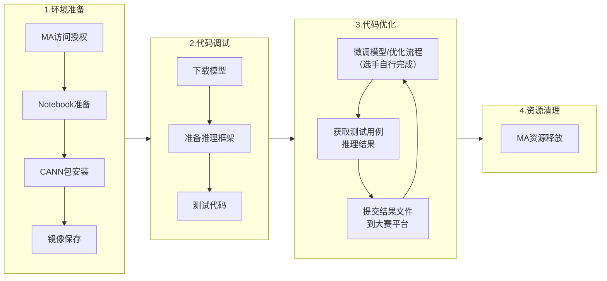

# 2025挑战杯指导文档

## 前言

本文档旨在让选手熟悉挑战杯A榜的开发环境，掌握如何测试和提交代码，还可以了解ModelArts平台的基本使用方法。

注意：如何微调模型、调整推理参数、优化推理工程等内容，不属于本教程的范畴。



本案例涉及到的所有OBS、ModelArts等资源都应在**贵阳一**区域下运行：


## 准备环境

我们使用ModelArts对模型及工程进行调试训练，使用OBS存储服务存储数据、模型、代码。在ModelArts上使用Notebook、OBS存储服务、训练作业等等很多功能，都需要先进行访问授权。[点此进入ModelArts控制台](https://console.huaweicloud.com/modelarts/?region=cn-southwest-2#/dashboard)，按照以下步骤操作即可。

- 选择左侧导航栏中的权限管理，在右侧界面中点击添加授权：
  

- 在弹出的添加授权界面中，按照下图所示依次操作：
  

### 准备notebook

[点击进入ModelArts的开发环境](https://console.huaweicloud.com/modelarts/?region=cn-southwest-2&locale=zh-cn#/dev-container)，右上角创建Notebook：


选择对应的镜像、计算规格与存储配置，其中存储配置方面，文件可以放在`/cache`目录下，这样不会占用EVS空间，但`/cache`目录会在每次启动时刷新。如果想要持久化存储，请对EVS扩容，同时将安装文件存储至`/home/ma-user/work`，存储会持续产生少量费用（无论是否运行），代金券使用场景覆盖存储。


我们可以选择公开镜像：`pytorch_2.1.0-cann_8.0.rc2-py_3.9-euler_2.10.7-aarch64-snt9b`，后续安装了8.1.RC1版本软件包后，可以参考文档 [保存Notebook实例](https://support.huaweicloud.com/usermanual-standard-modelarts/devtool-modelarts_0008.html) 保存为自定义镜像供后续使用。

创建完成后，点击**打开**进入notebook。为了方便配置环境变量等，我们在Terminal中进行操作，点击**Terminal**进入终端：


切换环境：

```shell
conda deactivate
conda activate python-3.9.10
```

接下来即可安装软件包。

### 下载并安装CANN软件包

我们的安装包要从 `.myhuaweicloud.com`域名下载，因此从no_proxy环境变量中删除`.myhuaweicloud.com`：

```shell
env | grep no_proxy
```

假设输出为：`no_proxy=127.0.0.1,localhost,172.16.*,obs.cn-southwest-2.myhuaweicloud.com,iam.cn-southwest-2.huaweicloud.com,pip.modelarts.private.com,.myhuaweicloud.com`，我们删除`.myhuaweicloud.com`：

```shell
export no_proxy=127.0.0.1,localhost,172.16.*,obs.cn-southwest-2.myhuaweicloud.com,iam.cn-southwest-2.huaweicloud.com,pip.modelarts.private.com
```

下载并安装CANN软件包，默认安装目录为`$HOME`，软件包较大，可能需要几分钟：

```shell
wget https://ascend-repo.obs.cn-east-2.myhuaweicloud.com/CANN/CANN%208.1.RC1/Ascend-cann-toolkit_8.1.RC1_linux-"$(uname -i)".run
chmod +x ./Ascend-cann-toolkit_8.1.RC1_linux-"$(uname -i)".run
./Ascend-cann-toolkit_8.1.RC1_linux-"$(uname -i)".run --full --quiet
```
出现如下日志，说明安装成功：

```shell
Toolkit:  Ascend-cann-toolkit_8.1.RC1_linux-aarch64 install success, installed in /home/ma-user/Ascend.
```

安装成功后，需要激活环境变量：

```shell
source /home/ma-user/Ascend/ascend-toolkit/set_env.sh
```

### 下载并安装CANN算子二进制包

```shell
wget https://ascend-repo.obs.cn-east-2.myhuaweicloud.com/CANN/CANN%208.1.RC1/Ascend-cann-kernels-910b_8.1.RC1_linux-"$(uname -i)".run
chmod +x ./Ascend-cann-kernels-910b_8.1.RC1_linux-"$(uname -i)".run
./Ascend-cann-kernels-910b_8.1.RC1_linux-"$(uname -i)".run --install --quiet
```

出现如下日志，说明安装成功：

```shell
[kernels_910b] [2025xxxx-xx:xx:xx] [INFO] Ascend-cann-kernels-910b_8.1.RC1_linux-aarch64 install success. The installation path is /home/ma-user/Ascend/ascend-toolkit.
```

### 下载并安装nnal

```shell
wget https://ascend-repo.obs.cn-east-2.myhuaweicloud.com/CANN/CANN%208.1.RC1/Ascend-cann-nnal_8.1.RC1_linux-"$(uname -i)".run
chmod +x ./Ascend-cann-nnal_8.1.RC1_linux-"$(uname -i)".run
./Ascend-cann-nnal_8.1.RC1_linux-"$(uname -i)".run --install --quiet
```

出现如下日志，说明安装成功：

```shell
[NNAL] [2025xxxx-xx:xx:xx] [INFO] Ascend-cann-nnal_8.1.RC1_linux-aarch64.run install success
```

安装成功后，需要激活环境变量：

```shell
source /home/ma-user/Ascend/nnal/atb/set_env.sh
```

### 准备torch相关环境

```shell
pip install torch==2.5.1 torch-npu==2.5.1
```

至此，我们已经完成了全部环境准备的工作。

建议将上述source set_env.sh添加到/home/ma-user/.bashrc中。保存为自定义镜像后，后续启动notebook无需再准备环境。

<font color="red">请注意，B榜判分环境使用的软件依赖与上述环境一致，此外选手可以在提交的模型包中配置可以通过pip安装的依赖包。</font>

## 下载模型

<strong>请注意，本次大赛不约束模型结构，但参赛选手只能使用3B及以下的模型。</strong>

我们以[Qwen2.5-3B](https://huggingface.co/Qwen/Qwen2.5-3B)为例，使用modelscope下载开源模型：

```shell
pip install modelscope==1.25.0
modelscope download --model Qwen/Qwen2.5-3B --local_dir /home/ma-user/work/Qwen2.5-3B
```
模型保存在`/home/ma-user/work/Qwen2.5-3B`目录下。

## 推理框架

我们使用开源推理框架[vllm](https://github.com/vllm-project/vllm/blob/v0.8.4/README.md)以及昇腾后端插件[vllm-ascend](https://github.com/vllm-project/vllm-ascend/tree/v0.8.4rc2)进行推理，昇腾后端插件具体使用可以参考文档：[vLLM Ascend Plugin](https://vllm-ascend.readthedocs.io/en/latest/index.html)。

推理框架依赖下载安装至指定文件夹下：

```shell
mkdir -p requirements 
```
安装vllm：

```shell
cd requirements
git clone --depth 1 --branch v0.8.4 https://github.com/vllm-project/vllm
cd vllm
VLLM_TARGET_DEVICE=empty pip install -v -e . --user
cd ..
```
<font color="red">如果安装vllm最后有报错，请尝试使用： VLLM_TARGET_DEVICE=empty pip install -v -e . --user </font>

安装vllm-ascend：

```shell
git clone --depth 1 --branch v0.8.4rc2 https://github.com/vllm-project/vllm-ascend.git
cd vllm-ascend
COMPILE_CUSTOM_KERNELS=0 pip install -v -e .
cd ..
```

查看安装结果：

```shell
pip list | grep vllm
```

## 推理测试

准备好推理框架后，我们可以进行测试。

进入`$WORK_DIR`目录下，使用离线推理测试：

```shell
cd $WORK_DIR
vim offline_inference.py
```
推理脚本如下：

```python
from vllm import LLM, SamplingParams

prompts = [
    "Hello, my name is",
    "The president of the United States is",
    "The capital of France is",
    "The future of AI is",
]

# Create a sampling params object.
sampling_params = SamplingParams(temperature=0.8, top_p=0.95)
# Create an LLM.
llm = LLM(model="/home/ma-user/work/Qwen2.5-3B")

# Generate texts from the prompts.
outputs = llm.generate(prompts, sampling_params)
for output in outputs:
    prompt = output.prompt
    generated_text = output.outputs[0].text
    print(f"Prompt: {prompt!r}, Generated text: {generated_text!r}")
```

运行：

```shell
python offline_inference.py
```

结果如下：


至此，我们已经完成了全部推理的依赖工作。

## 使用测试用例推理

我们的测试用例是以jsonl格式组织的，每行一条用例，每条用例具体字段如下：

| 字段  | 类型 | 释义 |
| ------------ | ------------ | ------------ |
| id  | 字符串 | 测试用例唯一标识符  |
| type  | 字符串 | 测试用例类型，共有 choice、code-generate、generic-generate、math四种类型 |
| prompt  | 字符串 | 测试用例内容  |
| choices  | 字典 | choice类型特有，测试用例选项 |

选手应该以指定格式返回推理结果：

```json
{"result": {
    "results": [
        {"id": " id1", "content": "xxx"}, 
        {"id": " id2", "content": "xxx"}],
    }
}

```

我们会试图在返回内容中按照某种特定格式提取回答，首先，提取"\<answer>"标签内内容:

```python
format_pattern = re.compile(r'^<think>(.*?)</think>\s*<answer>(.*?)</answer>$', re.DOTALL)
format_pattern.findall(content)
```

接下来，根据不同类型问题，会使用不同格式匹配提取，具体类型说明如下：

| 类型  | 匹配内容 |
| ------------ | ------------ |
| choice  | `r"(?i)Answer[ \t]*:[ \t]*\$?([A-D]*)\$?"` |
| code-generate  | `r"```python\n(.*?)```"` |
| generic-generate  | `r"(?i)Answer\s*:\s*([^\n]+)"` |
| math  | `r"(?i)Answer\s*:\s*\s*([^\n]+)"` |

其中，math校验精度时期望大家提供的结果符合latex标准，并包裹在`\boxed{}`框内，如`\\boxed{\\frac{1}{2}}`(`\\`以防转义）。一个示例如下：

```json
{
    "id": "681c2bbeb449f9165cc85ba5", 
    "content": "Answer: \\boxed{\\frac{\\sqrt{2} + \\sqrt{6}}{4}}"
},
```

对于上述所有格式，如果没有匹配到内容，则会使用原始字符串做精度校验。

我们将结合业界常用的评估方法，给出参考的prompt模板：

| 类型  | 参考模板 |
| ------------ | ------------ |
| choice  | "Answer the following multiple choice question. The last line of your response should be of the following format: 'Answer: $LETTER' (without quotes) where LETTER is one of ABCD. Think step by step before answering.\n\n{Question}\n\nA) {A}\nB) {B}\nC) {C}\nD) {D}" |
| code-generate  | "Read the following function signature and docstring, and fully implement the function described. Your response should only contain the code for this function.\n" | 
| generic-generate  | "You will be asked to read a passage and answer a question. Think step by step, then write a line of the form 'Answer: $ANSWER' at the end of your response." |
| math  | "Solve the following math problem step by step. The last line of your response should be of the form Answer: \$ANSWER (without quotes) where $ANSWER is the answer to the problem.\n\n{Question}\n\nRemember to put your answer on its own line after 'Answer:', and indicate your final answer in boxed LaTeX. For example, if the final answer is \sqrt{3}, write it as \boxed{\sqrt{3}}." |

**特别说明**：对于code-generate类型问题，选手可以返回3条结果，我们使用pass@3作为评价指标，如：

```json
{
    "id": "681c2cf3b449f9165cc85baa", 
    "content": ["<think>...</think><answer>    import time\n    time.sleep(5)\n    return 1</answer>", "    return 1", "\treturn 1"]
},
```
对于不足3条的结果，我们会使用已有结果随机扩展到3条，对于超过3条的结果，会随机采样3条。

一个测试用例读取与推理结果返回的端到端案例如下：

```python
import json
from vllm import LLM, SamplingParams

class Infer:
    def __init__(self, model="/home/ma-user/work/Qwen2.5-3B"):
        self.llm = LLM(model=model)
        self.sampling_params = {
            "choice": SamplingParams(max_tokens=1024, temperature=0.8, top_p=0.95),
            "code-generate": SamplingParams(n=3, max_tokens=2048, temperature=0.8, top_p=0.95),
            "generic-generate": SamplingParams(max_tokens=128, temperature=0.8, top_p=0.95),
            "math": SamplingParams(max_tokens=512, temperature=0.8, top_p=0.95)
        }
        self.prompt_templates = {
            "choice": "Answer the following multiple choice question. The last line of your response should be of the following format: 'Answer: $LETTER' (without quotes) where LETTER is one of ABCD. Think step by step before answering.\n\n{Question}\n\nA) {A}\nB) {B}\nC) {C}\nD) {D}",
            "code-generate": "Read the following function signature and docstring, and fully implement the function described. Your response should only contain the code for this function.\n",
            "generic-generate": "You will be asked to read a passage and answer a question. Think step by step, then write a line of the form 'Answer: $ANSWER' at the end of your response.",
            "math": "Solve the following math problem step by step. The last line of your response should be of the form Answer: \$ANSWER (without quotes) where $ANSWER is the answer to the problem.\n\n{Question}\n\nRemember to put your answer on its own line after 'Answer:', and indicate your final answer in boxed LaTeX. For example, if the final answer is \sqrt{3}, write it as \boxed{\sqrt{3}}."
        }

    def infer(self, data_file="A.jsonl"):
        a_datas = []
        with open(data_file, 'r', encoding="utf-8") as f:
            for line in f:
                a_data = json.loads(line)
                a_datas.append(a_data)

        res = {"result": {"results": []}}

        for a_data in a_datas:
            type_ = a_data.get("type")
            id_ = a_data.get("id")

            template = self.prompt_templates[type_]
            prompt = ""

            if type_ == "choice":
                choices = a_data["choices"]
                prompt = template.format(Question=a_data["prompt"], A=choices["A"], B=choices["B"], C=choices["C"], D=choices["D"])
            
            elif type_ == "math":
                prompt = template.format(Question=a_data["prompt"])
            else:
                prompt = template + a_data["prompt"]
            
            generated_text = []
            outputs = self.llm.generate(prompt, self.sampling_params[type_])
            for output in outputs:
                for o in output.outputs:
                    generated_text.append(o.text)
            generated_text = generated_text[0] if len(generated_text) == 1 else generated_text
            res["result"]["results"].append({"id": id_, "content": generated_text})

        return res


if __name__ == "__main__":

    infer = Infer(model="/home/ma-user/work/Qwen2.5-3B")
    res = infer.infer(data_file="A.jsonl")
    with open("res.json", "w", encoding="utf-8") as f:
        json.dump(res, f, ensure_ascii=False)
        
```

**请注意，该案例仅供参考，选手可以根据自己的优化点组织代码。**
